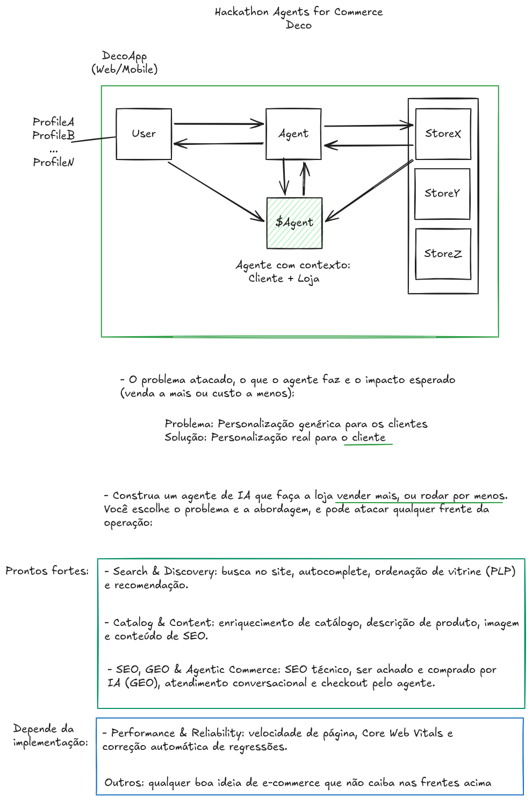

# $Agent (`cagent`) — Contextual & Personal Commerce Agent

> **Hackathon:** Agents for Commerce (Deco)  
> **Trilha Principal:** Search & Discovery / SEO, GEO & Agentic Commerce  
> **Objetivo:** Transformar a busca genérica em uma **personalização real baseada em contexto estendido do cliente e das lojas**, fazendo a loja **vender mais** e **rodar por menos**.

---

## 💡 O Problema
No e-commerce tradicional de alto volume, a personalização é passiva e fragmentada:
* O consumidor é forçado a preencher preferências e ajustar filtros manuais (tamanho, cor, faixa de preço, ocasião) em **cada nova loja** que visita.
* As lojas não compartilham contexto nem entendem a intenção real do comprador, gerando recomendações genéricas, abandono de busca e perda de conversão.

---

## 🚀 A Solução: $Agent (`cagent`)
O **`$Agent`** atua como uma ponte de inteligência contextual entre o usuário e as storefronts. Ele centraliza as preferências, histórico e perfil do cliente, aplicando "filtros inteligentes" em tempo real para qualquer loja integrada à rede Deco.



---

## 🎯 Pilares e Pontos Fortes

### 1. 🔍 Search & Discovery (Busca & Recomendação)
* **Busca Contextual:** Entendimento semântico da intenção de busca via LLM.
* **Autocomplete Inteligente:** Sugestões em tempo real baseadas no perfil do cliente.
* **Ordenação de Vitrine (PLP):** Reordenação dinâmica de produtos conforme gostos, tamanho e orçamento.
* **Recomendações Pessoais:** Sugestões hiper-personalizadas na primeira dobra da tela.

### 2. 📦 Catalog & Content (Enriquecimento de Catálogo)
* **Enriquecimento de Produtos:** Automação na adição de metadados, atributos e tags.
* **Descrições & SEO:** Geração inteligente de descrições otimizadas para motores de busca e conversão.

### 3. 🤖 SEO, GEO & Agentic Commerce (Comércio Agêntico)
* **GEO (Generative Engine Optimization):** Preparado para ser achado e recomendado por assistentes e IAs generativas.
* **Atendimento Conversacional:** Agente de linguagem natural que tira dúvidas sobre produtos em tempo real.
* **Checkout Assistido:** Interação direta para acelerar a tomada de decisão e o fluxo de compra.

---

## 🏗️ Arquitetura Híbrida / Monorepo (Web + Mobile App)

O repositório adota uma **arquitetura híbrida modular (Monorepo)** que compartilha a inteligência do agente, os tipos do TypeScript e a lógica de contexto entre as plataformas Web e Mobile:

```
cagent/
├── apps/ (ou diretórios de aplicação)
│   ├── web/        # Storefront Web (React + Vite + TailwindCSS)
│   └── mobile/     # App Mobile (React Native + Expo)
├── api/            # Serverless Functions (Vercel + Google Gemini API)
├── packages/
│   └── shared/     # Tipos (UserProfiles, StoreContext), schemas e Engine do Agente
├── docs/           # Guias e especificações internas (oculto no git local)
└── cagent.png      # Diagrama de Arquitetura
```

---

## 🏬 Módulo Plug & Play / White-Label (MVP Reutilizável)
O repositório foi desenvolvido como uma **solução open-source templatizada** para que qualquer loja possa copiar e reutilizar:
* **Fork & Go:** Estrutura modular pronta para ser copiada ou forkada por qualquer comerciante.
* **Multi-Plataforma (Web & Expo Mobile):** Suporte tanto a storefront Web quanto ao aplicativo Mobile via **Expo**.
* **Estilização Ágil (TailwindCSS):** Interface desenvolvida com **Vite + TailwindCSS** (Web) e compatível com **Expo** (Mobile).
* **Conectividade de Dados & Vercel Deploy:** Deploy em 1 clique na Vercel com Serverless Functions (`/api`), conectando qualquer banco de dados, inventário ou API de catálogo via variáveis de ambiente (`.env`) e adaptadores.

---

## 📈 Impacto de Negócio (ROI)

* 🟢 **Vender Mais:** Aumento da taxa de conversão (Search-to-Cart) através da entrega imediata do produto certo.
* 🟢 **Rodar por Menos:** Eficiência operacional via automação no enriquecimento de catálogo e atendimento por agente.
* 🟢 **Redução de Abandono:** Eliminação de buscas sem resultado ou navegação irrelevante.
* 🟢 **LTV & Retenção:** Experiência de compra fluida que fideliza o consumidor na plataforma.

---

## 🛠️ Arquitetura e Tecnologias

* **Web Storefront:** React (TypeScript) + **Vite** + **TailwindCSS**
* **Mobile App:** React Native com **Expo**
* **Shared Core:** Tipos compartilhados, Schemas de `UserProfile` e Orquestrador do Agente
* **Agente / Back-end:** Node.js (TypeScript) + **Google Gemini API / Vertex AI** via Vercel Serverless Functions (`/api`)
* **Hosting & Deploy:** **Vercel** (Web + APIs Serverless) + **Expo Application Services / GCP**
* **Integração:** Mesh de lojas, conectores de banco de dados modulares e APIs Deco Storefront

---

## ⚙️ Como Rodar o Projeto Localmente

### Pré-requisitos
* Node.js >= 18.x
* npm ou yarn
* Expo CLI (`npx expo`) para o app mobile

### Passo a Passo

1. **Clonar o Repositório:**
   ```bash
   git clone https://github.com/SEU_USUARIO/cagent.git
   cd cagent
   ```

2. **Instalar Dependências:**
   ```bash
   npm install
   ```

3. **Configuração de Variáveis de Ambiente:**
   Crie um arquivo `.env` na raiz do projeto baseado no `.env.example`:
   ```bash
   cp .env.example .env
   ```
   Adicione a sua chave da Gemini API:
   ```env
   GEMINI_API_KEY=seu_api_key_aqui
   ```

   > ⚠️ **Nota de Segurança:** O arquivo `.env` está no `.gitignore`. Nunca suba suas chaves de API para o GitHub público.

4. **Executar as Aplicações:**
   - **Web (Vite):** `npm run dev:web`
   - **Mobile (Expo):** `npm run dev:mobile`

---

## 🌐 Deploy na Vercel

O projeto está otimizado para deploy instantâneo da Web e APIs na **Vercel**:
1. Conecte o repositório no dashboard da Vercel.
2. Adicione a variável `GEMINI_API_KEY` nas configurações de **Environment Variables**.
3. O deploy do frontend Web (Vite) e das Serverless Functions (`/api`) será feito automaticamente a cada `git push`.

---

## 🛡️ Segurança & Boas Práticas (Public Repository Notice)

* Nenhuma chave privada ou credencial de produção da GCP / Gemini / Anthropic / OpenAI está exposta no código-fonte.
* Autenticação e requisições sensíveis são tratadas via variáveis protegidas em ambiente de execução Serverless.

---

## 📄 Licença

Este projeto é disponibilizado sob a licença **MIT** — permitindo livre uso, cópia, modificação, fork, redistribuição e integração comercial por qualquer loja ou desenvolvedor. Veja o arquivo [LICENSE](file:///home/jp/gh/cagent/LICENSE) para o texto completo.

---

## 🎥 Vídeo de Demonstração

* [Link para o Vídeo de 3 minutos em Ação] *(Vou adicionar no fim do projeto)*

---

*Desenvolvido durante o Hackathon Agents for Commerce — Deco (2026).*
